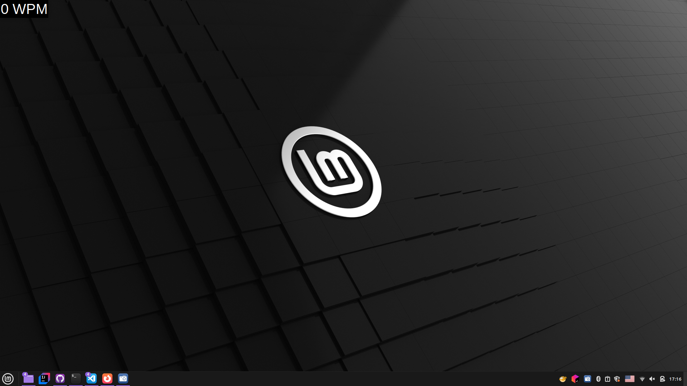

# WPM Display

A lightweight, real-time typing speed overlay that measures your WPM (Words Per Minute) during everyday computer use.

## Why This Project?

Unlike typing test websites that measure speed in controlled, idealized environments, WPM Display tracks your actual typing speed during real-world tasks—whether you're writing emails, coding, or chatting. This provides a more accurate picture of your practical typing performance.

## Features

- 🎯 Real-time WPM tracking overlay
- 👻 Transparent, always-on-top window
- 📊 Continuous speed measurement across all applications
- 🪶 Lightweight and non-intrusive

## Screenshot



## Installation

1. **Clone the repository**
   ```bash
   git clone https://github.com/kais-grati/WPM-Display
   cd wpm-display
   ```

2. **Create a virtual environment**
   ```bash
   python -m venv venv
   ```

3. **Activate the virtual environment**
   - Windows: `venv\Scripts\activate`
   - macOS/Linux: `source venv/bin/activate`

4. **Install dependencies**
   ```bash
   pip install -r requirements.txt
   ```

5. **Run the application**
   ```bash
   python main.py
   ```


## Contributing

Feel free to open issues or submit pull requests to enhance the measurement algorithm or add new features.
